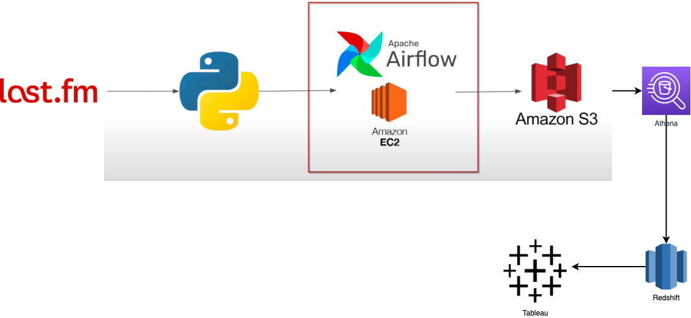

## Introduction 
In this project, I executed a Data Engineering Project on Last.FM artist trend analysis using Last.FM API, Airflow, EC2, ect.

## Architecture 

## Technology Used
- Programming Language - Python
- AWS 
1. S3
2. EC2
3. Athena
4. Redshift
5. Airflow
6. Tableau
7. API request

